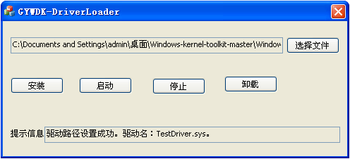

# Windows Kernel Driver Loader

A driver loader tool that helps in the study of Windows kernel.

Video Demo: [Vimeo](https://vimeo.com/434961824)

Executable File Download: [Google Drive](https://drive.google.com/drive/folders/1VDc8WPfizfodK9w2Ms7CNlHzCLLhC5qi?usp=sharing)

Notes:
- A way to grant Ring 0 privilege for user's code (i.e. assigning value to a NULL pointer's pointing address would cause the blue screen error, instead of a specific application's crash) 
- The successfully loaded user's code acts as a module binded with the kernel program ntoskrnl.exe

---

# Window内核驱动加载器

一个驱动加载工具，在Windows内核的学习过程中可以提供帮助。

演示视频：[BiliBili](https://www.bilibili.com/video/BV1jz411v74g/)

可执行文件下载：[蓝奏云](https://wws.lanzous.com/io5z4e9hk4j)

说明：
- 让用户代码在0环权限下运行的途径（比如在代码里给空指针指向的内存赋值，会直接造成系统蓝屏重启，而非仅仅是单体程序的崩溃）
- 成功加载后的用户代码，是内核程序ntoskrnl.exe的一个模块
